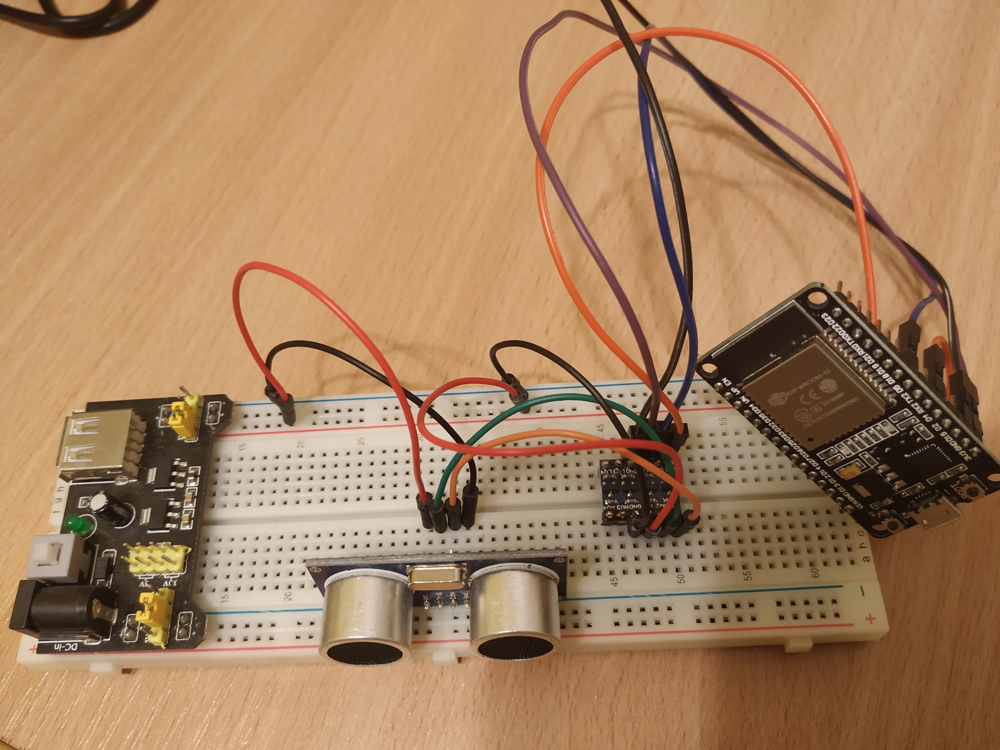

| Supported Targets | ESP32 |
| ----------------- | ----- |

Made based on ESP BLE Mesh Sensor Server Example
==================================

For description of this example please refer to [ESP BLE Mesh Sensor Client Example](../sensor_client/README.md)

This part of sensor server is responsible for measuring distances with sonar sensor SU-100

Connection and how it is look like

